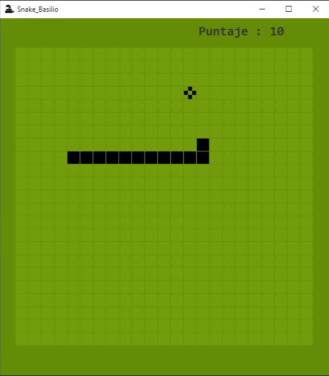

# SnakeGame-Java
Juego clásico de Snake desarrollado en Java con el IDE Eclipse. 

Video : https://youtu.be/OZe4mcL8sxA

Para este proyecto se hizo uso de :
- Clase Graphic.
- Clase Math.
- POO.
- Thread (Hilos).
- Logica basica (condicionales, bucles, contadores y acumuladores etc.)

Acerca del Juego:
- Se mueve con las teclas A,W,S,D.
- El juego actualiza el puntaje e incrementa la velocidad cada vez que la serpiente come.

### Nota
Este proyecto se desarrolló siguiendo este video https://youtu.be/Fh5fFE5h8tw pero agregando nuevas funcionalidades para mejorarlo.
