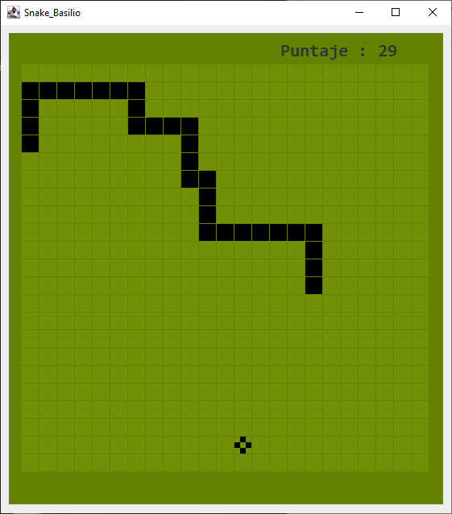

# SnakeGame-Java
Juego clásico de Snake desarrollado en Java con Eclipse.

Para este proyecto se hizo uso de :
- Clase Graphic.
- Clase Math.
- POO.
- Thread (Hilos).
- Logica basica (condicionales, bucles, contadores y acumuladores etc.)

Acerca del Juego:
- Se mueve con las teclas A,W,S,D.
- Actualiza el puntaje cada vez que la serpiente come.
- Aumenta la velocidad cada vez que la serpiente come.

Importante:
- Aunque se siguio el video, algunas cosas son diferentes ademas que se agregó algunas funcionalidades.
- Para ejecutarlo, pegue las tres carpetas dentro de la carpeta src del proyecto.

### Referencia
https://youtu.be/Fh5fFE5h8tw
